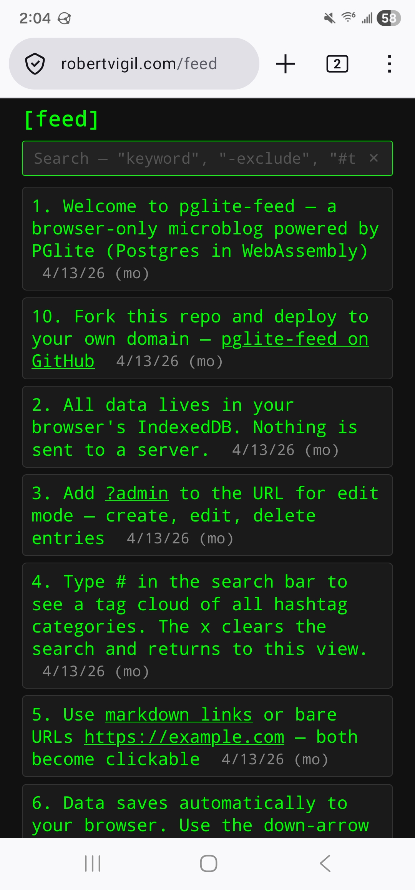

# pglite-feed

A browser-only microblog/feed powered by [PGlite](https://pglite.dev/) (PostgreSQL compiled to WebAssembly). No backend, no accounts. Data lives in your browser's IndexedDB.



## How it works

A static web app loaded in your browser. Entries live in the browser's IndexedDB via PGlite. Content is managed locally via `?admin` mode. A `feed.json` file auto-loads as sample content on first visit.

## Features

- **Date filtering** — use `after:2026-04-01` and `before:2026-04-14` in the search bar for date ranges.
- **Search** — multi-word AND with exclusion: `"pglite feed"` matches both terms, `"-exclude"` filters out a term.
- **Hashtag categories** — use `#tags` in content for categories (e.g., `#links`, `#notes`), then search for `#tag` to filter.
- **Smart default view** — empty search shows only entries without hashtags. Tagged reference data (like cheat sheets) stays hidden until you search for it.
- **Tag cloud** — type `#` in the search bar to see all hashtags with counts. Click any tag to search for it.
- **Search via URL** — `?search=%23git` pre-fills the search bar. Enables clickable links in content that trigger searches.
- **Clear button (×)** — clears the search and returns to the default view. Acts as a "home" button.
- **Admin mode (`?admin`)** — add `?admin` to the URL for full CRUD.
- **Markdown-style links** — `[display text](url)` in content becomes a clickable link. Bare URLs are also auto-linked.
- **JSON Save/Open** — save all entries to a JSON file, open a file to replace all content (traditional file metaphor, not merge).
- **Auto-load on empty DB** — first visit loads `feed.json` (sample/help content). After that, you manage everything via admin mode.
- **Keyboard-friendly** — Esc cancels create/edit, Enter submits forms.
- **Mobile responsive** — compact cards on small screens, tables on desktop.
- **Retro terminal aesthetic** — green-on-black monochrome theme.

## URL Modes

| URL | What you see |
|---|---|
| `/feed/` | Read-only view of all entries |
| `/feed/?admin` | Full CRUD controls |

## Search behavior

| Search input | Behavior |
|---|---|
| *(empty)* | Show only entries with NO hashtags |
| `#` | Show tag cloud with counts |
| `#git` | Normal search — entries containing "#git" |
| `git` | Normal search — entries containing "git" (tagged or not) |
| `git #` | Strip the lone `#`, treat as just `git` |
| `chmod #permissions` | Normal AND search — entries with both |
| `-#git` | Normal exclude — entries NOT containing "#git" |
| `after:2026-04-01` | Entries on or after this date |
| `before:2026-04-14` | Entries on or before this date |
| `after:2026-04-01 before:2026-04-14 #git` | Date range + tag search combined |

### Linkable searches

Content can include clickable links that trigger searches using URL-encoded `?search=` parameters:

```
[files](?search=%23files)                          → searches for #files
[chmod](?search=chmod)                              → searches for chmod
[ssh tunnel](?search=ssh%20-L)                     → searches for ssh -L
[april entries](?search=after%3A2026-04-01)        → searches for after:2026-04-01
[april git](?search=after%3A2026-04-01%20%23git)   → searches for after:2026-04-01 #git
```

These URLs can be shared directly — the recipient loads the app with the search pre-filled.

This lets non-tagged "index" entries link to tagged content without being hidden by the default view filter.

## Schema

```sql
CREATE TABLE feed (
  id SERIAL PRIMARY KEY,
  feed_date DATE NOT NULL,
  feed_content TEXT NOT NULL,
  UNIQUE (feed_date, feed_content)
);
```

- Categories are handled via `#tags` in `feed_content`, searchable with the built-in search
- The `UNIQUE` constraint prevents duplicate entries

## Running it

### Local: serve via any static file server

PGlite loads as an ES module from a CDN, which browsers block over `file://` — so you need a web server:

```bash
python3 -m http.server 8767
```

Then open `http://localhost:8767/`.

### Deploy to a real server

It's two files: `index.html` + `feed.json`. Drop them behind any web server — nginx, Caddy, Vercel, GitHub Pages, etc.

## JSON Save / Open

**Save (↓ button):** exports ALL entries as a JSON array. User picks the filename. Default: `feed.json`.

**Open (↑ button):** replaces ALL existing content with the contents of a JSON file. Prompts with a warning before replacing. This is a complete replacement, not a merge.

This matches the traditional "Open File" / "Save File" mental model.

### feed.json format

```json
[
  {"feed_date": "2026-04-12", "feed_content": "Hello world"},
  {"feed_date": "2026-04-12", "feed_content": "A note about links #links"}
]
```

## Content formatting

Two types of links are supported in `feed_content`:

- **Markdown-style:** `[click here](https://example.com)` → "click here" as a clickable link
- **Bare URLs:** `https://example.com` → the URL itself as a clickable link

Both can be mixed in one entry.

## Linked pages (optional)

Entries can link to static pages hosted alongside the feed:

- `/public/page.html` — accessible by anyone
- `/private/page.html` — behind basic auth (nginx `auth_basic`)

The feed app has no awareness of these pages — they're just URLs in the content. The auth boundary is the web server's job.

## Data privacy

- All data lives in your browser's IndexedDB
- Nothing is sent to any server
- Other visitors get their own empty database (or the sample `feed.json` content on first visit)
- `?admin` is a UX toggle, not real auth — anyone can use it, but they only edit their own browser's data

## Forking

Clone the repo, deploy to your own domain, and you get the full workflow:

1. Visit `?admin`, create entries
2. Tag entries with #hashtags to create categories
3. Save to `feed.json`, upload to your server
4. Your visitors see your content on first visit

## Browser support

Needs a modern browser with ES modules, IndexedDB, WebAssembly, and `:has()` CSS selector (2023+).

## License

MIT — see `LICENSE`.

---

*This project was vibe-coded with [Claude Code](https://claude.ai/claude-code).*
