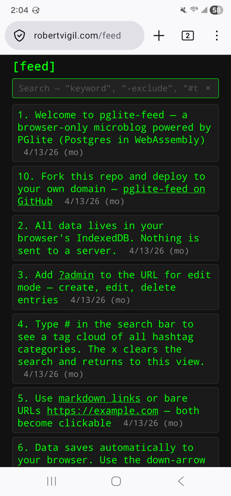

# pglite-feed

A browser-only microblog/feed powered by [PGlite](https://pglite.dev/) (PostgreSQL compiled to WebAssembly). No backend, no accounts. Data lives in your browser's IndexedDB.



**Live demo:** [robertvigil.com/feed](https://robertvigil.com/public/feed)

## How it works

A static web app loaded in your browser. Entries live in the browser's IndexedDB via PGlite. A single-entry `feed.json` seeds a brand-new browser with a pointer to the docs.

## Features

- **Date filtering** — use `after:2026-04-01` and `before:2026-04-14` in the search bar for date ranges. Symbolic dates (`after:today`, `before:week-end`) and relative offsets (`+7d`, `-30d`) are supported and resolve at parse time, making `?search=after:today` URLs evergreen.
- **Search** — multi-word AND with exclusion: `"pglite feed"` matches both terms, `"-exclude"` filters out a term.
- **Hashtag categories** — use `#tags` in content for categories (e.g., `#links`, `#notes`), then search for `#tag` to filter.
- **Smart default view** — empty search shows entries without hashtags, plus any entry tagged `#pin`. Tagged reference data stays hidden until you search for it. Use `#pin` to force important tagged entries onto the front page.
- **Pin to front page** — tag any entry with `#pin` and it appears on the default view regardless of other tags (e.g., `server setup guide #sysadmin #pin`).
- **Tag cloud** — type `#` in the search bar to see all hashtags with counts and percentages. Click any tag to search for it.
- **Search via URL** — `?search=%23git` pre-fills the search bar. Enables clickable links in content that trigger searches.
- **Clear button (×)** — clears the search and returns to the default view. Acts as a "home" button.
- **Inline CRUD** — create (✚), edit (✎), and delete (✕) entries directly. Always visible.
- **Configurable title** — type `!title My Site` in the search bar to customize the `[feed]` header. Included in JSON exports.
- **Theme support** — type `!theme amber`, `!theme white`, or `!theme green` in the search bar to switch the accent color. Persists across sessions and is included in JSON exports.
- **Markdown-style links** — `[display text](url)` in content becomes a clickable link. Bare URLs are also auto-linked.
- **Persistence** — IndexedDB is the store; files are backups you ask for. `!local` writes named JSON snapshots into a folder you pick (or downloads them where the File System Access API is missing), and `!cloud` does the same encrypted to jsonbin. Exactly one transport is connected at a time.
- **Auto-load on empty DB** — first visit loads `feed.json`, a single entry linking the in-app help and the repo. Delete it and the app is yours.
- **Keyboard-friendly** — Esc cancels create/edit, Ctrl+Enter or Shift+Enter submits forms.
- **Mobile responsive** — compact cards on small screens, tables on desktop.
- **Retro terminal aesthetic** — green-on-black by default, with amber and white alternatives.

## Search syntax

Search runs as you type (debounced via the `input` event); commands and the filtered tag cloud are committed on Enter.

| Input | Behavior |
|---|---|
| *(empty)* | Show entries with no hashtags, plus any tagged `#pin`. Reference data stays hidden by default. |
| `word` | AND substring match across `feed_content`. |
| `word1 word2` | AND match — both terms must appear. |
| `-word` | Exclude — entries NOT containing the term. |
| `#a\|#b` | OR alternation within one token — entries matching either. No spaces around `\|`. Combines with AND/exclude/dates as you'd expect. |
| `#tag` | Find entries containing the literal `#tag`. |
| `#` | Show **full tag cloud** with counts and percentages, sorted by frequency. Percentages are each tag's share of matched rows; `<1%` for vanishingly rare ones. |
| `# term1 term2` | Show **filtered tag cloud** — counts computed only over entries matching `term1 AND term2`. Any regular search syntax (`-`, `after:`, `before:`, `#tag`) works after the leading `#`. |
| `# #git` | Tag cloud of entries containing `#git`. Useful for "what tags co-occur with this one?" |
| `git #` | Trailing/middle `#` is stripped — only **leading** `#` is a mode flag. Treated as just `git`. |
| `after:YYYY-MM-DD` | Entries on or after this date (ISO format). |
| `before:YYYY-MM-DD` | Entries on or before this date (ISO format). |
| `after:today` / `before:tomorrow` | Symbolic date names — see table below. Resolved at parse time, so `?search=after:today` URLs are evergreen. |
| `after:-7d` / `before:+30d` | Relative offsets from today. Format: `[+-]<int><unit>` where unit is `d`, `w`, `m`, `y`. |
| `after:... before:... #git` | All filters combine with AND. |
| `-#git` | Exclude entries containing `#git`. |
| `#pin` | The pin override — any entry tagged `#pin` shows on the default view regardless of other tags. |

Single-character search terms (`a`, `i`, etc.) are stripped as noise — too broad to be useful. The lone `#` mode flag is detected before this rule applies.

### Symbolic dates and relative offsets

`after:` and `before:` accept three input forms — ISO date, symbolic name, or relative offset. Resolution happens *every time the search runs*, so a URL like `?search=after:today` always means "today as of right now" — perfect for evergreen calendar links.

**Symbolic names:**

| Name | Resolves to |
|---|---|
| `today` | current date |
| `yesterday` | -1 day |
| `tomorrow` | +1 day |
| `week-start` | most recent Monday |
| `week-end` | week-start + 6 days (Sunday) |
| `month-start` | 1st of current month |
| `month-end` | last day of current month |
| `year-start` | January 1 of current year |
| `year-end` | December 31 of current year |

**Relative offsets:** `[+-]<integer><unit>`, where unit is one of:

| Unit | Meaning |
|---|---|
| `d` | days (`+7d`, `-30d`) |
| `w` | weeks (`+2w`, `-4w`) |
| `m` | months (`+1m`, `-3m`) — clamps to last valid day of target month, so `Jan 31 + 1m` → `Feb 28`/`29` (not `Mar 3`) |
| `y` | years (`+1y`, `-2y`) — clamps leap-year edges, so `Feb 29 + 1y` → `Feb 28` (not `Mar 1`) |

**Example calendar URLs (evergreen):**

```
[Today](?search=after:today%20before:today)
[This week](?search=after:week-start%20before:week-end)
[This month](?search=after:month-start%20before:month-end)
[Upcoming 30 days](?search=after:today%20before:%2B30d)
[Past week](?search=after:-7d%20before:today)
```

(The `%2B` in `+30d` is the URL-encoded `+`, since raw `+` in URLs decodes to a space.)

Invalid date values (e.g., `after:notadate`) silently drop the filter rather than erroring — your search still runs, just without the date constraint.

### Clicking tags in the cloud

Click any tag → search is replaced with just that tag (drops any filter that was scoping the cloud). To drill deeper, type a fresh `# tag1 tag2` query.

A **📋 button** appears in the search bar when the query is shareable — clicking it copies the corresponding `?search=...` URL to your clipboard, properly encoded.

## Schema

```sql
CREATE TABLE feed (
  id SERIAL PRIMARY KEY,
  feed_date DATE NOT NULL,
  feed_content TEXT NOT NULL,
  UNIQUE (feed_date, feed_content)
);
```

- Categories are handled via `#tags` in `feed_content`, searchable with the built-in search
- The `UNIQUE` constraint prevents duplicate entries

## Running it

### Local: serve via any static file server

PGlite loads as an ES module from a CDN, which browsers block over `file://` — so you need a web server:

```bash
python3 -m http.server 8767
```

Then open `http://localhost:8767/`.

### Deploy to a real server

It's two files: `index.html` + `feed.json`. Drop them behind any web server — nginx, Caddy, Vercel, GitHub Pages, etc.

## Commands (`!` prefix)

Typed into the search bar, committed with Enter. While a `!` command is in the box,
search does not fire.

| Command | Effect |
|---|---|
| `!title My Site` | Set the page title to `[My Site]`. |
| `!title` | Clear — revert to default `[feed]`. |
| `!theme green` | Switch to green-on-black (default). |
| `!theme amber` | Switch to amber-on-black. |
| `!theme white` | Switch to white-on-black. |
| `!theme` | Clear — revert to green. |
| `!cloud …` | Encrypted remote snapshots — see below. |
| `!local …` | Snapshots in a folder on disk — see below. |

Title and theme persist in the `config` table and are included in JSON exports.

## Persistence


### Snapshots, not auto-save

There is no always-on file sync. Until 2026-08-22 two icons (`🔗` / `📝`) attached the
feed to a JSON file and rewrote it on every edit; both are gone. IndexedDB is the
store and a file is a backup, so writing one on every keystroke was solving a problem
that did not exist — and the `☁`/`💾` indicator already tells you when a backup is
stale.

Use `!local` (folder on disk) or `!cloud` (encrypted, remote) instead. Both are
explicit push/pull with named snapshots. See the sections below.

### ↓ Save / ↑ Open (Firefox / Safari / non-secure HTTP)

**Save (↓):** exports ALL entries as a JSON file via download. User picks the filename. Default: `feed.json`.

**Open (↑):** replaces ALL existing content with the contents of a JSON file. Prompts with a warning before replacing. Complete replacement, not a merge.

Traditional "Open File" / "Save File" mental model.

### feed.json format

Flat array (simple):
```json
[
  {"feed_date": "2026-04-12", "feed_content": "Hello world"},
  {"feed_date": "2026-04-12", "feed_content": "A note about links #links"}
]
```

Object with config (includes site title and other settings):
```json
{
  "config": {"site_title": "my site", "theme": "amber"},
  "entries": [
    {"feed_date": "2026-04-12", "feed_content": "Hello world"}
  ]
}
```

Both formats are supported on import. Export uses the object format when config exists.

## Cloud snapshots (encrypted, optional)

*Read-write mode only.* Push and pull **encrypted** snapshots to [jsonbin.io](https://jsonbin.io) to move your feed between devices without a synced file. Everything is encrypted **in your browser** before upload — jsonbin only stores ciphertext.

**One-time setup**

1. Make a free jsonbin.io account, create a **Collection**, and copy its Collection ID.
2. In the search bar, run `!cloud jsonbin <collectionId>`. You'll be prompted (masked) for your jsonbin **Master Key**.
3. On your first `!cloud push` you'll be prompted for an **encryption passphrase**. Use the *same* passphrase on every device.

Both secrets live in this device's IndexedDB (set once, not re-typed each session). `!cloud off` forgets them.

**Commands** (all in the search bar)

| Command | What it does |
|---|---|
| `!cloud` | Show status: collection, device, what's stored, in-sync vs unsaved |
| `!cloud jsonbin <collectionId>` | Configure the backend (prompts for master key) |
| `!cloud list` | List your remote snapshots — no passphrase needed |
| `!cloud delete <name>` | Permanently delete a remote snapshot |
| `!cloud push [name]` | Encrypt + upload a snapshot (default name `main`) |
| `!cloud pull [name]` | Download + decrypt + load a snapshot (replaces local data) |
| `!cloud device <label>` | Label this device (`laptop`, `phone`) so `list` is readable |
| `!cloud off` | Disconnect and forget secrets on this device |

Snapshots are **named** — keep a `main` plus backups, and pull any of them onto any device. A small `☁` indicator under the search bar shows when local changes haven't been pushed (click it to push).

**Notes**

- Data is **gzip-compressed then encrypted** (WebCrypto **PBKDF2 (250k) → AES-GCM**), so the uploaded blob is small; needs a secure context (https or localhost). What's stored remotely is always a JSON envelope with a base64 `ct` field — jsonbin never sees gzip or your data.
- Each snapshot carries a cleartext `app` tag, so trying to `!cloud pull` an *activities* backup into the feed is refused before anything is decrypted.
- jsonbin's free tier caps bin size at 100 KB (Pro: 1 MB). Compression usually keeps you well under the free limit; a very large export may still need a self-hosted backend (planned: the `RemoteStore` interface lets a `robertvigil.com/vault` backend slot in behind the same commands).

## Content formatting

Two types of links are supported in `feed_content`:

- **Markdown-style:** `[click here](https://example.com)` → "click here" as a clickable link
- **Bare URLs:** `https://example.com` → the URL itself as a clickable link

Both can be mixed in one entry.

## Linked pages (optional)

Entries can link to static pages hosted alongside the feed:

- `/assets/page.html` — accessible by anyone
- `/private/page.html` — behind basic auth (nginx `auth_basic`)

The feed app has no awareness of these pages — they're just URLs in the content. The auth boundary is the web server's job.

## Local snapshots (`!local`)

The same push/pull model as `!cloud`, but the snapshots are plain JSON files in a
folder you choose on this machine — no account, no network, no encryption.

**One-time setup**

1. Run `!local attach` in the search bar. A folder picker opens; choose (or make) a
   directory to keep snapshots in.
2. Run `!local push`. That writes `feed.json` into the folder.

The folder is remembered per device. Browsers do **not** persist folder permission
across sessions, so the first `!local` command after a browser restart re-prompts —
that's expected, not an error.

**Commands** (all in the search bar)

| Command | What it does |
|---|---|
| `!local` | Show status: folder, permission, last sync, in-sync vs unsaved |
| `!local attach` | Pick the folder snapshots live in |
| `!local list` | List the `.json` snapshots in that folder |
| `!local push [name]` | Write a snapshot (default name `feed`) |
| `!local pull [name]` | Load a snapshot (**replaces** local data) |
| `!local delete <name>` | Delete that snapshot file — your data is untouched |
| `!local off` | Forget the folder on this device (files are kept) |

Names are bare words, no quotes and no paths: `!local push before-trip` writes
`before-trip.json` beside the default one.

**Notes**

- **Files are plain, unencrypted `{config, entries}`** — the same shape the app has
  always exported. That's deliberate: PGlite's IndexedDB store is itself unencrypted,
  so encrypting a backup sitting next to a plaintext browser profile buys nothing.
  If the folder is inside a synced directory (Dropbox, Syncthing), plaintext does
  leave the machine — use `!cloud` for that case.
- Snapshots written by `!cloud` **can** be pulled locally: `!local pull` detects an
  encrypted envelope by its `ct` field and asks for the passphrase. Only writing is
  simplified.
- **No File System Access API?** (Firefox, Safari, plain HTTP) `!local` still works —
  `push` downloads the file and `pull` opens a file picker. Same commands, degraded
  transport underneath.
- **One transport at a time.** Turning on `!local` disconnects `!cloud` and vice
  versa — you are asked to confirm the switch, never silently detached. Bare
  `!local` / `!cloud` both report which one is ACTIVE.
- The status-line indicator follows the active transport: `☁` for cloud, `💾` for
  local, hidden when neither is on. Its tooltip names the transport, so "in sync"
  is never ambiguous. Clicking it pushes to whichever transport is active.
- If the attached folder's permission has lapsed (new browser session), the
  indicator turns amber with `⚠` — click it once to re-grant, then it resumes.

## URL parameters

`?search=<encoded>` pre-fills the search bar on load. Lets content link to searches.

### Encoding cheat sheet

| Character | Encoded | Notes |
|---|---|---|
| `#` | `%23` | **Must** be encoded — raw `#` truncates the URL at the fragment. |
| ` ` (space) | `%20` | **Must** be encoded — raw space breaks address-bar parsing. |
| `:` | `%3A` | Used in `after:` / `before:`. |
| `\|` | `%7C` | Optional in modern browsers (raw `\|` usually works), but encoding is the safe form. |
| `-` | `-` | Unreserved — never needs encoding. |
| `+` | `%2B` | **Must** be encoded — raw `+` in URLs decodes to a space. Used in relative offsets like `+30d`. |

> The encoded `%23` doesn't trigger the "no hashtags" default-view filter — that regex matches literal `#[a-zA-Z]`, not the URL-encoded form. So `?search=%23pin` is a valid way to land on pinned content via URL.

### Examples

```
[files](?search=%23files)                          → #files                      (single tag)
[chmod](?search=chmod)                              → chmod                       (substring)
[ssh tunnel](?search=ssh%20-L)                     → ssh -L                      (AND)
[exclude mastered](?search=-%23mastered)           → -#mastered                  (NOT)
[pending or mastered](?search=%23pending%7C%23mastered) → #pending|#mastered     (OR)
[neither](?search=-%23pending%7C%23mastered)       → -#pending|#mastered         (NOT both)
[combo](?search=%23pending%7C%23mastered%20%23f1)  → #pending|#mastered #f1      (OR + AND)
[april entries](?search=after%3A2026-04-01)        → after:2026-04-01            (date)
[git tags](?search=%23%20%23git)                   → # #git                      (filtered tag cloud)
```

These URLs can be shared directly — recipients open the app with the search pre-filled. Term order doesn't matter; the parser sorts include/exclude/dates into buckets regardless of position.

**Clicking a `?search=...` link inside the app updates in place — no page reload.** The search bar re-fills, the URL bar updates, the query fires. Back/forward buttons walk through your search history. Modifier-click (Cmd/Ctrl/Shift/middle-click) still opens in a new tab as expected. URLs entered via the address bar or shared from elsewhere still load fresh — that's required for the page to load at all from outside.

To generate one programmatically: `encodeURIComponent(searchString)` in JavaScript, `urllib.parse.quote(s)` in Python.

### Copy a search as a shareable URL (📋 button)

Easier than encoding by hand: type your query into the search bar, then click the **📋** icon that appears between the search input and the × clear button. The full `?search=...` URL is copied to your clipboard, properly encoded for `#`, spaces, `+`, `:`, `|`, and the rest. Icon briefly flashes to ✓ as confirmation.

The button is **hidden when:**

- The search bar is empty (nothing to share).
- The search starts with `!` (commands don't auto-fire from URL pre-fill, so the link would be useless).

Symbolic dates and relative offsets (`after:today`, `before:+30d`) survive copy-as-URL unchanged — they get encoded literally and resolve against the recipient's "today" when the link is opened. That's why these URLs stay evergreen.

## Keyboard shortcuts

| Key | Effect |
|---|---|
| `Esc` | Cancel the open create form, or cancel an in-progress row edit. |
| `Ctrl+Enter` / `Shift+Enter` | Submit the create form, or save an in-progress row edit. |
| `Enter` (in search) | Run a `!` command (otherwise search runs on input). |

## Data privacy

- All data lives in your browser's IndexedDB
- Nothing is sent to any server
- Other visitors get their own empty database (seeded with the one `feed.json` entry on first visit)
- There's no admin login — editing controls are always visible, but each visitor only edits their own browser's data

## Forking

Clone the repo, deploy to your own domain, and you get the full workflow:

1. Create entries, tag them with #hashtags
2. Snapshot your data with `!local push` (a folder on disk) or `!cloud push` (encrypted, jsonbin)
3. Pull that snapshot on any other browser or device

The app is single-user by design: every visitor gets their own database in their own
browser, and there is no server-managed content.

## Built with

- [PGlite](https://pglite.dev/) — PostgreSQL compiled to WebAssembly, by ElectricSQL
- [marked](https://marked.js.org/) — Markdown parser and compiler
- [marked-gfm-heading-id](https://github.com/markedjs/marked-gfm-heading-id) — GitHub-style heading anchors for marked
- [KaTeX](https://katex.org/) — Fast math typesetting (`$E = mc^2$` → rendered equations)
- [marked-katex-extension](https://github.com/UziTech/marked-katex-extension) — KaTeX integration for marked

No frameworks, no build tools, no package manager. All dependencies loaded as ES modules from CDN.

## Browser support

Needs a modern browser with ES modules, IndexedDB, WebAssembly, and `:has()` CSS selector (2023+).

`!local` uses the [File System Access API](https://caniuse.com/native-filesystem-api) to write into a folder you pick, which needs a secure context (HTTPS or `localhost`):

- ✅ **Chrome / Edge / Arc / Opera** — works out of the box.
- ⚠️ **Brave** — may need `brave://flags/#file-system-access-api` set to **Enabled**, then relaunch.
- ❌ **Firefox / Safari** — no folder. `!local` still works: `push` downloads the snapshot and `pull` opens a file picker. Same commands, same data.

To verify in DevTools: `'showSaveFilePicker' in window && window.isSecureContext` should return `true`.

## License

MIT — see `LICENSE`.

---

*This project was vibe-coded with [Claude Code](https://claude.ai/claude-code).*
