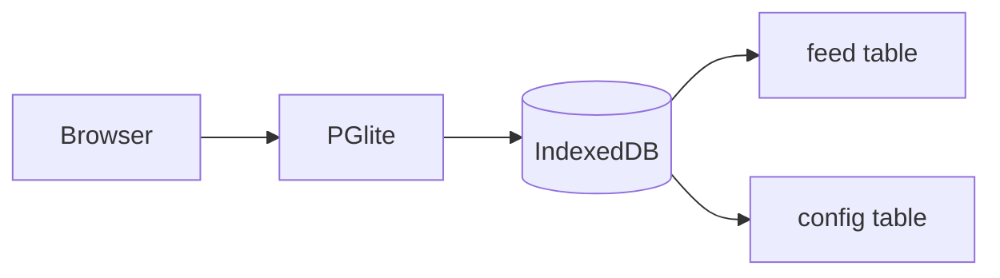
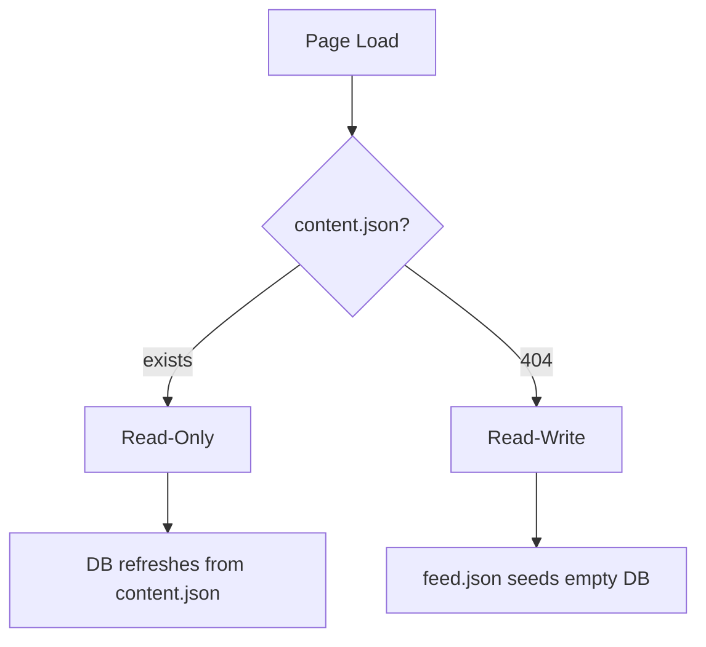

# pglite-feed — help

Comprehensive reference for the search bar, commands, persistence, and content formatting. The high-level overview lives in the welcome entries on the home page; this is the manual.

## Contents

- [Modes](#modes)
- [Search syntax](#search-syntax)
- [Commands (`!` prefix)](#commands--prefix)
- [Keyboard shortcuts](#keyboard-shortcuts)
- [Persistence](#persistence)
- [URL parameters](#url-parameters)
- [Content formatting](#content-formatting)
- [Capabilities demo](#capabilities-demo)
- [Tech stack](#tech-stack)
- [Links](#links)

## Modes

The app auto-detects its mode on page load — no toggles, no URL flags.

| Trigger | Mode | Effect |
|---|---|---|
| `content.json` exists on server | **read-only** | Public-facing site. No CRUD, no `!` commands. DB refreshes from `content.json` when its `Last-Modified` changes. |
| `content.json` is 404 | **read-write** | Full editing controls always visible. `feed.json` seeds the DB on first visit. |

`?search=...` URL parameter works in both modes.

## Search syntax

Search runs as you type (debounced via the `input` event); commands and the filtered tag cloud are committed on Enter.

| Input | Behavior |
|---|---|
| *(empty)* | Show entries with no hashtags, plus any tagged `#pin`. Reference data stays hidden by default. |
| `word` | AND substring match across `feed_content`. |
| `word1 word2` | AND match — both terms must appear. |
| `-word` | Exclude — entries NOT containing the term. |
| `#a\|#b` | OR alternation within one token — entries matching either. No spaces around `\|`. Combines with AND/exclude/dates as you'd expect. |
| `#tag` | Find entries containing the literal `#tag`. |
| `#` | Show **full tag cloud** with counts and percentages, sorted by frequency. Percentages are each tag's share of matched rows; `<1%` for vanishingly rare ones. |
| `# term1 term2` | Show **filtered tag cloud** — counts computed only over entries matching `term1 AND term2`. Any regular search syntax (`-`, `after:`, `before:`, `#tag`) works after the leading `#`. |
| `# #git` | Tag cloud of entries containing `#git`. Useful for "what tags co-occur with this one?" |
| `git #` | Trailing/middle `#` is stripped — only **leading** `#` is a mode flag. Treated as just `git`. |
| `after:YYYY-MM-DD` | Entries on or after this date (ISO format). |
| `before:YYYY-MM-DD` | Entries on or before this date (ISO format). |
| `after:today` / `before:tomorrow` | Symbolic date names — see table below. Resolved at parse time, so `?search=after:today` URLs are evergreen. |
| `after:-7d` / `before:+30d` | Relative offsets from today. Format: `[+-]<int><unit>` where unit is `d`, `w`, `m`, `y`. |
| `after:... before:... #git` | All filters combine with AND. |
| `-#git` | Exclude entries containing `#git`. |
| `#pin` | The pin override — any entry tagged `#pin` shows on the default view regardless of other tags. |

Single-character search terms (`a`, `i`, etc.) are stripped as noise — too broad to be useful. The lone `#` mode flag is detected before this rule applies.

### Symbolic dates and relative offsets

`after:` and `before:` accept three input forms — ISO date, symbolic name, or relative offset. Resolution happens *every time the search runs*, so a URL like `?search=after:today` always means "today as of right now" — perfect for evergreen calendar links.

**Symbolic names:**

| Name | Resolves to |
|---|---|
| `today` | current date |
| `yesterday` | -1 day |
| `tomorrow` | +1 day |
| `week-start` | most recent Monday |
| `week-end` | week-start + 6 days (Sunday) |
| `month-start` | 1st of current month |
| `month-end` | last day of current month |
| `year-start` | January 1 of current year |
| `year-end` | December 31 of current year |

**Relative offsets:** `[+-]<integer><unit>`, where unit is one of:

| Unit | Meaning |
|---|---|
| `d` | days (`+7d`, `-30d`) |
| `w` | weeks (`+2w`, `-4w`) |
| `m` | months (`+1m`, `-3m`) — clamps to last valid day of target month, so `Jan 31 + 1m` → `Feb 28`/`29` (not `Mar 3`) |
| `y` | years (`+1y`, `-2y`) — clamps leap-year edges, so `Feb 29 + 1y` → `Feb 28` (not `Mar 1`) |

**Example calendar URLs (evergreen):**

```
[Today](?search=after:today%20before:today)
[This week](?search=after:week-start%20before:week-end)
[This month](?search=after:month-start%20before:month-end)
[Upcoming 30 days](?search=after:today%20before:%2B30d)
[Past week](?search=after:-7d%20before:today)
```

(The `%2B` in `+30d` is the URL-encoded `+`, since raw `+` in URLs decodes to a space.)

Invalid date values (e.g., `after:notadate`) silently drop the filter rather than erroring — your search still runs, just without the date constraint.

### Clicking tags in the cloud

Click any tag → search is replaced with just that tag (drops any filter that was scoping the cloud). To drill deeper, type a fresh `# tag1 tag2` query.

## Commands (`!` prefix)

Commands are read-write only and run on Enter. While typing a `!` command, search does not fire.

| Command | Effect |
|---|---|
| `!title My Site` | Set the page title to `[My Site]`. |
| `!title` | Clear — revert to default `[feed]`. |
| `!theme green` | Switch to green-on-black (default). |
| `!theme amber` | Switch to amber-on-black. |
| `!theme white` | Switch to white-on-black. |
| `!theme` | Clear — revert to green. |

Title and theme persist in the `config` table and are included in JSON exports. If a JSON file is attached, command changes auto-sync to disk.

## Keyboard shortcuts

| Key | Effect |
|---|---|
| `Esc` | Cancel the open create form, or cancel an in-progress row edit. |
| `Ctrl+Enter` / `Shift+Enter` | Submit the create form, or save an in-progress row edit. |
| `Enter` (in search) | Run a `!` command (otherwise search runs on input). |

## Persistence

The app picks one of two flows based on browser capability — only one is shown at a time. Capability check: `'showSaveFilePicker' in window && window.isSecureContext`.

### 🔗 / 📝 Attach (Chromium + secure context)

Available on Chrome / Edge / Arc / Opera. Brave requires `brave://flags/#file-system-access-api` enabled.

| Icon | Action |
|---|---|
| 🔗 Open | Pick an *existing* JSON file. App reads it. If it has entries: prompt to LOAD them into the feed (replaces current) or KEEP current (file untouched until next edit, which overwrites it). Safe — never destructive without asking. |
| 📝 Create | Pick a new path (default `feed.json`) or overwrite an existing file. Immediately writes current DB state to the chosen file. The OS shows its own "Replace?" warning for existing files. |

Once attached:
- Every edit (create / edit / delete / JSON Open / `!title` / `!theme`) writes the current DB to disk.
- Filename appears next to the icon: `🔗 feed.json`.
- New browser session shows amber `🔗 feed.json ⚠` — click once to re-grant write permission, then sync resumes silently.
- Click `🔗` while attached and granted → confirm-detach.
- Sync is **one-way** (app → file). External edits to the file are not picked up; the next app edit overwrites them.

The handle persists in a separate IndexedDB DB (`pglite-feed-handles`), independent of the main feed data.

### ↓ Save / ↑ Open (Firefox / Safari / non-secure HTTP)

| Icon | Action |
|---|---|
| ↓ Save | Download all entries (and config) as `feed.json`. |
| ↑ Open | Upload a JSON file. Replaces all existing content after a confirmation prompt. Complete replacement, not a merge. |

### JSON format (both flows)

Flat array (simple):
```json
[
  {"feed_date": "2026-04-12", "feed_content": "Hello world"}
]
```

Object with config (preserves title/theme):
```json
{
  "config": {"site_title": "my site", "theme": "amber"},
  "entries": [
    {"feed_date": "2026-04-12", "feed_content": "Hello world"}
  ]
}
```

Both formats import. Export uses the object form when config exists, flat array otherwise.

### Recovery

If the file vanishes mid-session (drive unmounted, file deleted, permission revoked), the next sync silently fails and the icon flips to amber `⚠`. IndexedDB is unaffected — no data loss. Click the amber icon:
- Permission expired → one click re-grants and triggers an overwrite from current DB state.
- File still missing → click `🔗` again to detach, then re-attach to a different file.

## URL parameters

`?search=<encoded>` pre-fills the search bar on load. Lets content link to searches.

### Encoding cheat sheet

| Character | Encoded | Notes |
|---|---|---|
| `#` | `%23` | **Must** be encoded — raw `#` truncates the URL at the fragment. |
| ` ` (space) | `%20` | **Must** be encoded — raw space breaks address-bar parsing. |
| `:` | `%3A` | Used in `after:` / `before:`. |
| `\|` | `%7C` | Optional in modern browsers (raw `\|` usually works), but encoding is the safe form. |
| `-` | `-` | Unreserved — never needs encoding. |
| `+` | `%2B` | **Must** be encoded — raw `+` in URLs decodes to a space. Used in relative offsets like `+30d`. |

> The encoded `%23` doesn't trigger the "no hashtags" default-view filter — that regex matches literal `#[a-zA-Z]`, not the URL-encoded form. So `?search=%23pin` is a valid way to land on pinned content via URL.

### Examples

```
[files](?search=%23files)                          → #files                      (single tag)
[chmod](?search=chmod)                              → chmod                       (substring)
[ssh tunnel](?search=ssh%20-L)                     → ssh -L                      (AND)
[exclude mastered](?search=-%23mastered)           → -#mastered                  (NOT)
[pending or mastered](?search=%23pending%7C%23mastered) → #pending|#mastered     (OR)
[neither](?search=-%23pending%7C%23mastered)       → -#pending|#mastered         (NOT both)
[combo](?search=%23pending%7C%23mastered%20%23f1)  → #pending|#mastered #f1      (OR + AND)
[april entries](?search=after%3A2026-04-01)        → after:2026-04-01            (date)
[git tags](?search=%23%20%23git)                   → # #git                      (filtered tag cloud)
```

These URLs can be shared directly — recipients open the app with the search pre-filled. Term order doesn't matter; the parser sorts include/exclude/dates into buckets regardless of position.

To generate one programmatically: `encodeURIComponent(searchString)` in JavaScript, `urllib.parse.quote(s)` in Python.

### Copy a search as a shareable URL (📋 button)

Easier than encoding by hand: type your query into the search bar, then click the **📋** icon that appears between the search input and the × clear button. The full `?search=...` URL is copied to your clipboard, properly encoded for `#`, spaces, `+`, `:`, `|`, and the rest. Icon briefly flashes to ✓ as confirmation.

The button is **hidden when:**

- The search bar is empty (nothing to share).
- The search starts with `!` (commands don't auto-fire from URL pre-fill, so the link would be useless).

Symbolic dates and relative offsets (`after:today`, `before:+30d`) survive copy-as-URL unchanged — they get encoded literally and resolve against the recipient's "today" when the link is opened. That's why these URLs stay evergreen.

## Content formatting

`feed_content` is rendered through `marked` with a few extensions, then a regex pass adds bare-URL auto-linking.

### Links

```markdown
[display text](https://example.com)   → custom-text link
https://example.com                    → bare URL auto-linked
[search link](?search=%23git)         → relative URL, opens in same tab
```

External links open in a new tab; relative ones open in place.

### Hashtags

Any `#word` in content becomes a category tag. Multiple per entry are fine: `chmod 755 #files #permissions`. Hashtags are searchable (`#permissions`), enumerable (`#`), and filterable (`# #permissions`). The default view hides tagged entries unless they also carry `#pin`.

### Markdown

Standard markdown: headings, lists, bold/italic, blockquotes, tables, code blocks, links, images, strikethrough, task lists.

### Math (KaTeX)

Inline: `$E = mc^2$` → $E = mc^2$.

Block:
```
$$f(x) = \frac{1}{\sigma\sqrt{2\pi}} e^{-\frac{1}{2}\left(\frac{x-\mu}{\sigma}\right)^2}$$
```

### Diagrams (Mermaid)

Fenced code blocks with `mermaid` language render as diagrams. Mermaid is lazy-loaded — only fetched if a diagram appears on the page.



## Capabilities demo

Math:
$$\sum_{i=1}^{n} i = \frac{n(n+1)}{2}$$

Matrix:
$$\begin{bmatrix} 1 & 2 \\ 3 & 4 \end{bmatrix} \begin{bmatrix} 5 \\ 6 \end{bmatrix} = \begin{bmatrix} 17 \\ 39 \end{bmatrix}$$

Mermaid:


Code:
```sql
CREATE TABLE feed (
  id SERIAL PRIMARY KEY,
  feed_date DATE NOT NULL,
  feed_content TEXT NOT NULL,
  UNIQUE (feed_date, feed_content)
);
```

Task list:
- [x] PGlite database working
- [x] Search with AND/exclude
- [x] Tag cloud with filter
- [x] Markdown viewer
- [ ] World domination

Strikethrough: ~~deprecated text~~. **Bold**, *italic*, `inline code` all work.

## Tech stack

| Component | What |
|---|---|
| **PGlite** | PostgreSQL compiled to WebAssembly |
| **IndexedDB** | Browser-native persistent storage (main feed data + attached file handle) |
| **marked.js** | Markdown rendering |
| **KaTeX** | Math/equation typesetting |
| **Mermaid** | Diagrams from text (lazy-loaded) |
| **File System Access API** | Live-sync to a real file on disk (Chromium only) |
| **Vanilla JS** | No frameworks, no build tools |

## Links

- [GitHub repo](https://github.com/robertvigil/pglite-feed)
- [PGlite documentation](https://pglite.dev/)
- [Live demo](https://robertvigil.com/public/feed/)
